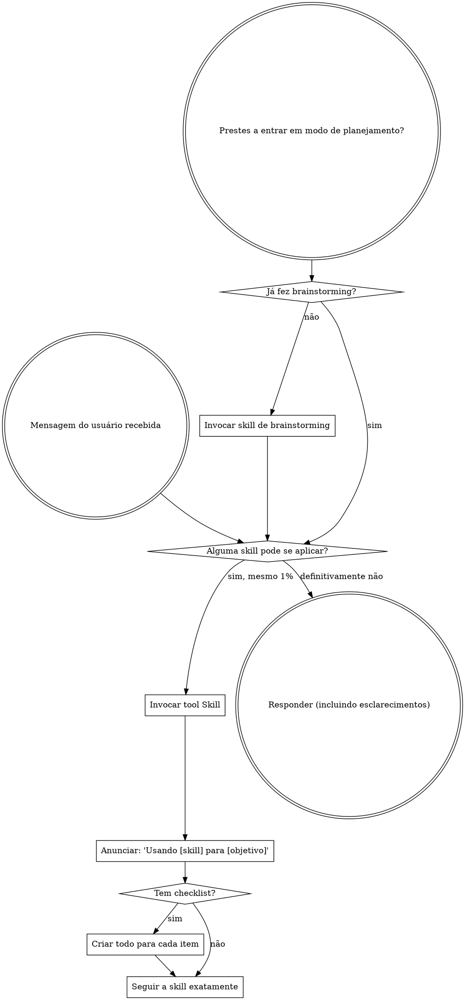

# Usando Superpowers

## A Regra
**Invoque skills relevantes ou solicitadas ANTES de qualquer resposta ou ação.** Mesmo uma chance de 1% de que uma skill possa se aplicar já é motivo para invocá-la e verificar. Se uma skill invocada acabar não sendo adequada para a situação, você não precisa usá-la.

## Sinais de Alerta
Esses pensamentos significam PARE — você está racionalizando:

| Pensamento | Realidade |
|---------|---------|
| "Isso é só uma pergunta simples" | Perguntas são tarefas. Verifique skills. |
| "Preciso de mais contexto primeiro" | A verificação de skill vem ANTES de perguntas de esclarecimento. |
| "Deixe eu explorar o código primeiro" | Skills dizem COMO explorar. Verifique primeiro. |
| "Posso checar git/arquivos rapidinho" | Arquivos não têm contexto da conversa. Verifique skills. |
| "Vou reunir informações primeiro" | Skills dizem COMO reunir informações. |
| "Isso não precisa de uma skill formal" | Se existe uma skill, use-a. |
| "Eu lembro dessa skill" | Skills evoluem. Leia a versão atual. |
| "Isso não conta como tarefa" | Ação = tarefa. Verifique skills. |
| "Essa skill é exagero" | Coisas simples ficam complexas. Use-a. |
| "Vou só fazer esta coisinha primeiro" | Verifique ANTES de fazer qualquer coisa. |
| "Isso parece produtivo" | Ação sem disciplina desperdiça tempo. Skills evitam isso. |
| "Eu sei o que isso significa" | Conhecer o conceito ≠ usar a skill. Invoque-a. |

## Prioridade de Instruções
Skills do Superpowers substituem o comportamento padrão do prompt do sistema, mas **as instruções do usuário sempre têm precedência**:

1. **Instruções explícitas do usuário** (`CLAUDE.md`, `GEMINI.md`, `AGENTS.md`, pedidos diretos) — prioridade máxima
2. **Skills do Superpowers** — substituem o comportamento padrão do sistema quando houver conflito
3. **Prompt padrão do sistema** — menor prioridade

Se `CLAUDE.md`, `GEMINI.md` ou `AGENTS.md` disser "não use TDD" e uma skill disser "sempre use TDD", siga as instruções do usuário. O usuário está no controle.

## Como Acessar Skills
**No Claude Code:** use a tool `Skill`. Quando você invoca uma skill, o conteúdo dela é carregado e apresentado a você — siga-o diretamente. Nunca use a tool Read em arquivos de skill.

**No Gemini CLI:** skills são ativadas pela tool `activate_skill`. O Gemini carrega os metadados das skills no início da sessão e ativa o conteúdo completo sob demanda.

**Em outros ambientes:** verifique a documentação da sua plataforma para entender como as skills são carregadas.

## Prioridade das Skills
Quando múltiplas skills puderem se aplicar, use esta ordem:

1. **Skills de processo primeiro** (`brainstorming`, `debugging`) — elas determinam COMO abordar a tarefa
2. **Skills de implementação depois** (`frontend-design`, `mcp-builder`) — elas guiam a execução

`Vamos construir X` → primeiro `brainstorming`, depois skills de implementação.
`Corrija este bug` → primeiro `debugging`, depois skills específicas do domínio.

## Tipos de Skill
**Rígidas** (`TDD`, `debugging`): siga exatamente. Não adapte para fugir da disciplina.

**Flexíveis** (padrões): adapte os princípios ao contexto.

A própria skill dirá qual tipo ela é.

## Instruções do Usuário
As instruções dizem O QUE fazer, não COMO. `Adicione X` ou `Corrija Y` não significa pular workflows.

## Adaptação de Plataforma
As skills usam nomes de tools do Claude Code. Em plataformas diferentes, consulte a documentação da plataforma para mapear equivalentes.
